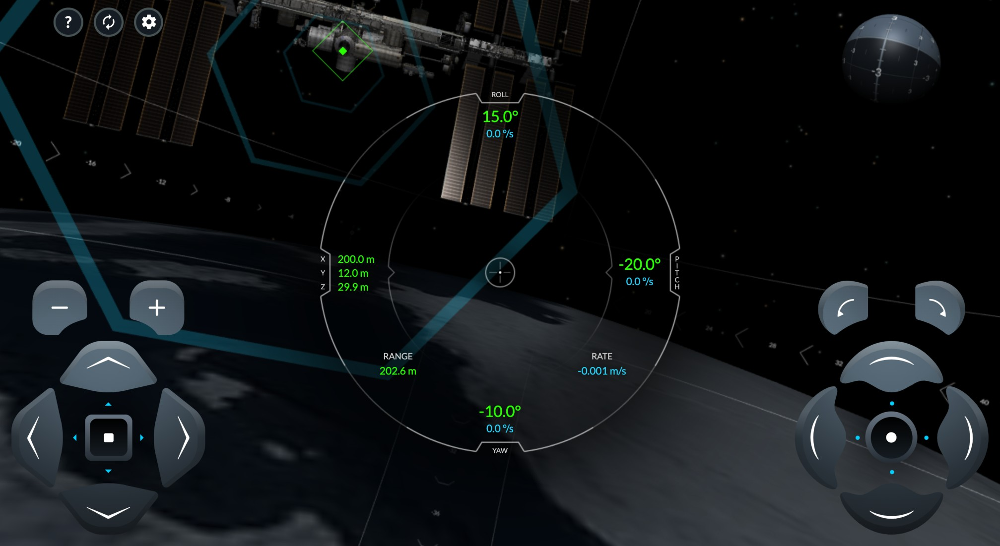

# About SpaceX ISS Docking simulator:
This simulator will familiarize you with the controls of the [actual interface](https://www.youtube.com/watch?v=MdJDBHzJF8E) used by NASA Astronauts to manually pilot the SpaceX Dragon 2 vehicle to the International Space Station. Successful docking is achieved when all green numbers in the center of the interface are below 0.2. Movement in space is slow and requires patience & precision.

